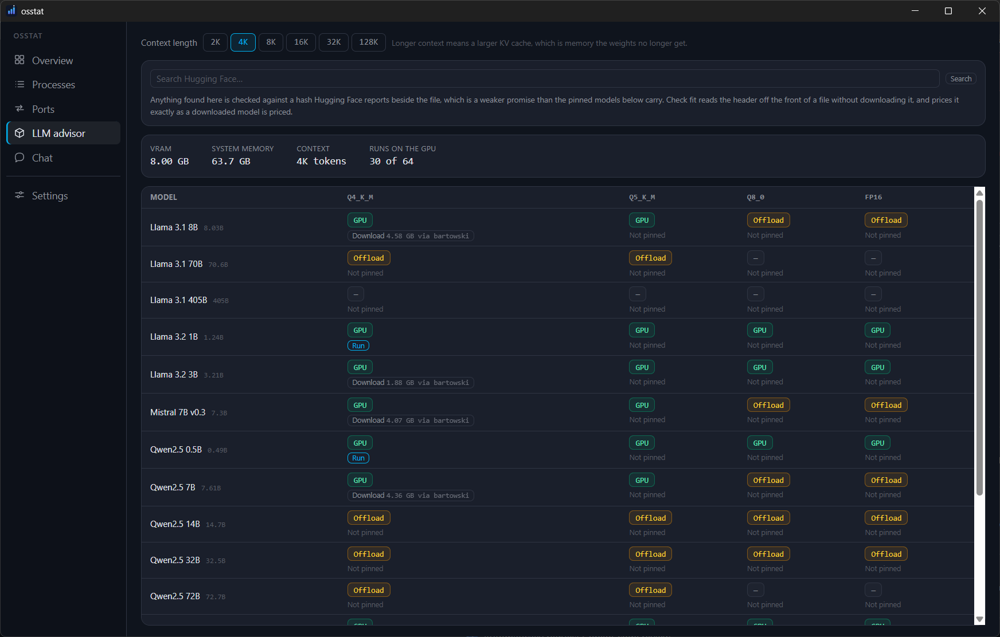
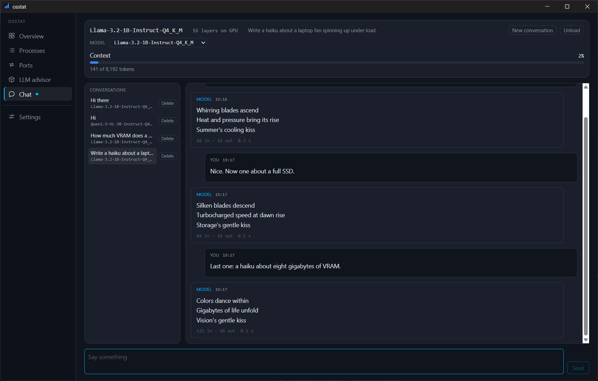

# osstat

[](https://github.com/dmadan86/osstat/actions/workflows/ci.yml)
[](#license)

A free, open-source system utility for Windows, Linux and macOS. It inspects your
machine, manages processes and ports, safely reclaims disk space, and tells you
which local LLMs your hardware can actually run.

> **Status: alpha.** System info, the process manager, ports, the LLM advisor and
> local inference all work. The cleaning engine does not exist yet. Builds are
> unsigned, so Windows and macOS will warn on install. Follow
> [ROADMAP.md](ROADMAP.md) for what is landing when.

## Screenshots

<!--
  Images live in docs/images/ and are referenced by the exact names below.
  Screenshots of the Overview, Processes and Ports tabs show real process
  names, PIDs and open ports -- check what is in frame before committing one,
  because git history keeps it even if the file is later replaced.
-->

|                                                                                               |                                                                                                  |
| --------------------------------------------------------------------------------------------- | ------------------------------------------------------------------------------------------------ |
|         |                                        |
| **LLM advisor** — every model priced against your actual hardware, with the arithmetic shown. | **Chat** — a model running locally, with context fill, tokens per second and per-message counts. |

## A walkthrough

What the LLM half of osstat does, end to end:

1. **Open the LLM tab.** Every model in the registry is priced against the GPU
   and memory osstat measured on your machine — not a guess from a spec sheet.
   The explanation drawer shows the arithmetic rather than hiding it.
2. **Search for anything else.** Public GGUF models on Hugging Face are searched
   from the same tab, and each result is priced _before_ you download it, by
   reading the real file's header over a range request. Searched models are
   labelled as unreviewed provenance, distinct from the curated ones osstat pins
   by hash.
3. **Download it.** Progress, transfer rate and estimated time; pause and resume
   across a dropped connection; automatic retry for what is worth retrying and an
   immediate, honest failure for what is not.
4. **Run it.** osstat starts a local `llama-server`, choosing the GPU layer count
   and context size from the model file's own header and your measured VRAM. The
   server binds loopback on a random port behind a per-session key, with its own
   web UI disabled.
5. **Chat.** Replies stream with timestamps, response times and per-message token
   counts, and the context window is drawn as a meter — the same one the Overview
   uses for CPU and RAM, because it is the resource that governs whether the model
   still remembers the start of your conversation.
6. **Unload when you are done.** The model stays loaded while you use other tabs,
   and the LLM tab shows which one is running. Nothing survives quitting osstat.

## What it does

| Capability          | What it gives you                                                              | Status |
| ------------------- | ------------------------------------------------------------------------------ | ------ |
| **System info**     | OS, kernel, CPU, memory, disks, GPUs, network — copyable as Markdown or JSON   | M1     |
| **Process manager** | Full process tree with per-process CPU/RAM/IO and permission-aware kill        | M1     |
| **Port inspector**  | Which process holds which port, and close it on demand                         | M2     |
| **System cleaner**  | Caches, logs, browser and dev-tool junk — previewed before anything is removed | M3     |
| **LLM advisor**     | Detects your GPU/VRAM/RAM and tells you which models and quantizations fit     | M4     |

## Why another cleaner

Most tools in this category are heavy, closed, and ask you to trust them with
delete permissions on your whole disk. osstat takes the opposite position:

- **Nothing is deleted without a preview.** Scanning and deleting are separate
  phases, and the default action is move-to-trash, not permanent removal.
- **It never runs elevated.** Operations that need admin rights ask for them one
  at a time, for that operation only. See [ADR-006](docs/adr/ADR-006-privilege-elevation.md).
- **No telemetry. None.** osstat makes no network requests except when you
  explicitly ask it to (for example, checking the model registry for updates).
  There is no analytics SDK, no crash reporter, and no phone-home.
- **The rules are readable.** What gets cleaned is defined in TOML manifests you
  can read, diff and contribute to — not compiled into a binary.
- **The log has nothing in it about you.** osstat keeps a week of daily log
  files under its app-data directory (`%APPDATA%\dev.osstat.app\logs` on
  Windows, `~/.local/share/dev.osstat.app/logs` on Linux,
  `~/Library/Application Support/dev.osstat.app/logs` on macOS). No file names,
  paths, process names, addresses, prompts or model replies reach one at any
  setting, so you can attach one to a bug report without reading it first.
  **Settings → Logs** chooses how much detail is captured and copies the set
  into a folder you name. [SECURITY.md](SECURITY.md#logs) explains how that is
  enforced rather than promised.
- **It is small.** A Rust backend with the OS's own webview, not a bundled browser.

Deliberately **not** included: registry "cleaning", driver updating, and malware
scanning. Those are the features that give this category its bad reputation, and
none of them measurably help.

## Install

No releases yet. Build from source (below); installers for `.msi`, `.dmg`,
`.AppImage`, `.deb` and `.rpm` arrive with v0.1.0.

## Build from source

Prerequisites:

- [Rust](https://rustup.rs) — the pinned toolchain in `rust-toolchain.toml` installs automatically
- [Node.js](https://nodejs.org) 20 or newer
- [just](https://github.com/casey/just) — `cargo install just`
- Platform build dependencies, per the [Tauri prerequisites](https://tauri.app/start/prerequisites/):
  - **Windows** — Visual Studio Build Tools (C++ workload) and the WebView2 runtime
  - **Linux** — `webkit2gtk-4.1`, `libayatana-appindicator3`, `librsvg2`, `build-essential`
  - **macOS** — Xcode Command Line Tools

```sh
git clone https://github.com/dmadan86/osstat.git
cd osstat
just setup     # install npm dependencies
just dev       # run the app with hot reload
just test      # Rust + frontend test suites
just ci        # everything a pull request must pass
```

`just` with no arguments lists every available target.

## Architecture

A Rust core with a webview front-end, built on [Tauri 2](https://tauri.app).
All privileged logic lives in Rust; the webview holds no OS access of its own.

```
crates/osstat-core/       portable domain types, traits and engines
crates/osstat-platform/   per-OS implementations, selected at compile time
src-tauri/                the desktop shell: commands, events, capabilities
ui/                       React + TypeScript front-end
docs/adr/                 the decisions behind all of the above
```

Every significant design decision is written down as an Architecture Decision
Record in [`docs/adr/`](docs/adr/). Start with
[ADR-001](docs/adr/ADR-001-application-framework.md) (why Tauri) and
[ADR-005](docs/adr/ADR-005-deletion-safety.md) (how deletion is kept safe).

## Contributing

Contributions are welcome — especially cleaning rules and LLM registry entries,
which need no Rust knowledge. See [CONTRIBUTING.md](CONTRIBUTING.md) for the
development setup, the commit convention, and the rule-authoring guide.

Security issues should go through [SECURITY.md](SECURITY.md), not a public issue.

## License

Dual-licensed under either of

- Apache License, Version 2.0 ([LICENSE-APACHE](LICENSE-APACHE))
- MIT license ([LICENSE-MIT](LICENSE-MIT))

at your option.

Unless you explicitly state otherwise, any contribution intentionally submitted
for inclusion in this project, as defined in the Apache-2.0 license, shall be
dual-licensed as above, without any additional terms or conditions.
